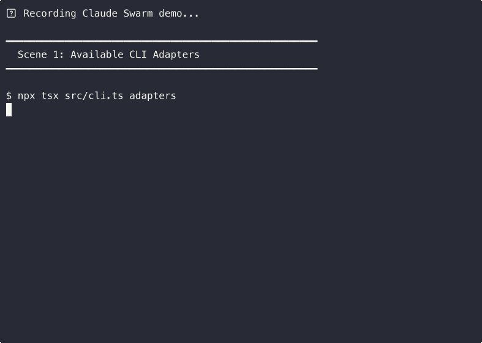

# Claude Swarm

> Multi-CLI agent orchestration. One command, multiple AI models, coordinated work.

**Claude Swarm** orchestrates Claude Code, Codex CLI, and Gemini CLI from a single terminal. Spawn a swarm of agents with different roles and models, monitor them in real-time, and collect results — all locally.



```
┌─────────────────────────────────────────────────────────────┐
│  🐝 CLAUDE SWARM — "Build a REST API"                       │
│  Mode: pipeline | Agents: 1/3 done | Elapsed: 45s           │
├─────────────────────────────────────────────────────────────┤
│                                                              │
│  ██████████████ DONE  planner (claude/sonnet-4-6)           │
│    Completed in 32s | 2.1KB output                           │
│                                                              │
│  ██████░░░░░░░░ RUN   implementer (codex/o4-mini)           │
│    18s elapsed | 1.4KB output | 23 lines                     │
│    > Writing Express routes for /todos endpoints...          │
│                                                              │
│  ░░░░░░░░░░░░░░ WAIT  reviewer (gemini/pro)                │
│    Waiting...                                                │
│                                                              │
├─────────────────────────────────────────────────────────────┤
│  Latest output (implementer):                                │
│  > Created src/routes/todos.ts with CRUD endpoints           │
│  > Added input validation with zod schemas                   │
└─────────────────────────────────────────────────────────────┘
```

## Why?

Every AI coding tool runs in its own silo. Claude Code doesn't talk to Codex. Codex doesn't talk to Gemini. You copy-paste between terminals.

Claude Swarm is the **layer above the agents**. It coordinates them:

- **Claude** plans the architecture (best at reasoning)
- **Codex** writes the code (best at implementation)
- **Gemini** reviews the result (independent perspective)

One command. Multiple models. Coordinated output.

## Install

```bash
git clone https://github.com/nghiack7/claude-swarm.git
cd claude-swarm
npm install
```

## Quick Start

### Run a swarm (default pipeline: planner → implementer → reviewer)

```bash
npx tsx src/cli.ts run "Build a todo REST API with Express and TypeScript"
```

### Custom agents with specific CLIs and models

```bash
npx tsx src/cli.ts run "Fix the auth bug in src/auth.ts" \
  --agent "analyst:claude:claude-sonnet-4-6" \
  --agent "fixer:codex:o4-mini" \
  --agent "reviewer:claude:claude-haiku-4-5-20251001"
```

### Parallel mode (all agents run simultaneously)

```bash
npx tsx src/cli.ts run "Review this codebase for security issues" \
  --agent "security:claude" \
  --agent "deps:codex" \
  --agent "secrets:gemini" \
  --mode parallel
```

### Check available adapters

```bash
npx tsx src/cli.ts adapters
```

```
CLI Adapters

  claude ● available (default model: claude-sonnet-4-6)
  codex  ● available (default model: o4-mini)
  gemini ✕ not found (default model: gemini-2.5-pro)
```

## Agent Spec Format

```
role:cli:model    Full spec      e.g. planner:claude:claude-sonnet-4-6
role:cli          Default model  e.g. coder:codex
role              Default CLI    e.g. reviewer (uses claude)
```

## Execution Modes

### Pipeline (default)

Agents run sequentially. Each agent receives the output of all previous agents as context.

```
planner ──→ implementer ──→ reviewer
  output ─────→ output ───────→ output
```

Best for: feature building, bug fixing, any task where later steps depend on earlier ones.

### Parallel

All agents run simultaneously with the same task description. No shared context between agents.

```
┌─ security-reviewer
├─ performance-auditor    (all run at once)
└─ code-quality-checker
```

Best for: independent reviews, multi-perspective analysis, parallelizable work.

## Architecture

```
User
 │
 ▼
CLI (claude-swarm run)
 │
 ├──→ Orchestrator
 │     ├── Adapter: Claude Code (claude -p "...")
 │     ├── Adapter: Codex CLI   (codex exec "...")
 │     └── Adapter: Gemini CLI  (gemini -p "...")
 │
 ├──→ TUI Dashboard (live terminal monitoring)
 │
 └──→ Broker (localhost:7899 + SQLite)
       ├── peers (discovery + status)
       ├── rooms (collaboration groups)
       ├── messages (queue + history)
       ├── tasks (delegation + tracking)
       └── scratchpad (shared memory)
```

**Two layers:**

1. **Orchestrator** — spawns CLI processes, constructs role-specific prompts, manages lifecycle, collects output. This is the new part.
2. **Broker** — the existing peer coordination system. MCP-connected Claude Code sessions can still discover each other, form rooms, and collaborate in real-time.

## Peer Coordination (MCP)

The orchestrator is one way to use Claude Swarm. You can also use it as an MCP server for real-time peer coordination between manually-opened sessions.

### Register as MCP server

```bash
claude mcp add --scope user --transport stdio claude-swarm -- npx tsx $(pwd)/src/server.ts
```

### 22 MCP Tools

| Category | Tools |
|----------|-------|
| **Core** | `list_peers`, `send_message`, `broadcast`, `check_messages`, `message_history`, `set_summary`, `set_name`, `set_status` |
| **Rooms** | `create_room`, `join_room`, `leave_room`, `list_rooms` |
| **Tasks** | `create_task`, `update_task`, `list_tasks` |
| **Scratchpad** | `scratchpad_get`, `scratchpad_set`, `scratchpad_list` |

## CLI Commands

```bash
# Orchestration
claude-swarm run <task>          # Run a multi-agent swarm
claude-swarm adapters            # List available CLI adapters

# Coordination
claude-swarm status              # Dashboard overview
claude-swarm peers               # List peers
claude-swarm rooms               # List rooms
claude-swarm send <id> <msg>     # Send direct message
claude-swarm broadcast <room> <msg>  # Broadcast to room
claude-swarm history [--room <id>] [--search <term>]
claude-swarm tasks <room_id>     # List tasks
claude-swarm scratchpad <room_id>    # Shared memory
claude-swarm kill                # Kill broker
claude-swarm help                # Help
```

## How It Works

1. You run `claude-swarm run "your task"` with agent specs
2. The orchestrator constructs a role-specific prompt for each agent
3. In **pipeline** mode, each agent's output becomes context for the next
4. In **parallel** mode, all agents run simultaneously
5. The TUI shows live progress: status, output size, latest lines
6. When complete, a summary shows each agent's output and timing

Each agent runs as a real CLI subprocess (`claude -p`, `codex exec`, `gemini -p`) with full tool access. They can edit files, run tests, and interact with your codebase.

## Default Pipeline

When no `--agent` flags are specified, Claude Swarm uses a 3-agent pipeline:

| Step | Role | CLI | Purpose |
|------|------|-----|---------|
| 1 | **Planner** | Claude | Architecture and implementation plan |
| 2 | **Implementer** | Claude | Write the code following the plan |
| 3 | **Reviewer** | Claude | Review for bugs, edge cases, improvements |

Customize by passing `--agent` flags. Mix and match CLIs freely.

## Key Design Decisions

- **Multi-CLI**: Not locked to one AI provider. Claude, Codex, Gemini, and any future CLI that accepts a prompt and returns output.
- **Local-only**: All traffic on 127.0.0.1. No cloud coordination, no API keys for swarm features.
- **Protocol-agnostic**: The broker speaks HTTP + SQLite. Any process can participate.
- **Zero config**: No YAML files needed. Agent specs are CLI flags. Defaults work out of the box.
- **Adapter pattern**: Adding a new CLI is ~20 lines. Implement `available()` and `spawn()`.

## Adding a New CLI Adapter

Edit `src/adapters.ts`:

```typescript
const myAdapter: CLIAdapter = {
  name: "mycli",
  defaultModel: "my-model",
  available: () => commandExists("mycli"),
  spawn: ({ prompt, model, cwd }) => {
    return spawn("mycli", ["run", prompt, "--model", model], {
      cwd, stdio: ["ignore", "pipe", "pipe"],
    });
  },
};
```

Then add it to the `adapters` registry. That's it.

## Environment

| Variable | Default | Description |
|----------|---------|-------------|
| `CLAUDE_SWARM_PORT` | `7899` | Broker port |
| `CLAUDE_SWARM_DB` | `~/.claude-swarm.db` | SQLite path |

## vs Other Tools

| Feature | Claude Swarm | Agent Teams | AMUX | Conductor |
|---------|-------------|-------------|------|-----------|
| Multi-CLI (Claude+Codex+Gemini) | ✓ | ✕ (Claude only) | ✕ | ✕ |
| One-command orchestration | ✓ | ✓ | ✕ | ✓ |
| Live TUI dashboard | ✓ | ✕ | Web UI | ✕ |
| Per-role model selection | ✓ | ✕ | ✕ | ✕ |
| Pipeline + parallel modes | ✓ | Parallel only | Parallel only | Parallel only |
| MCP peer coordination | ✓ | ✕ | ✕ | ✕ |
| Shared scratchpad memory | ✓ | Shared tasks | ✕ | ✕ |
| Zero cloud dependency | ✓ | ✓ | ✓ | ✕ |
| Adapter pattern (extensible) | ✓ | ✕ | ✕ | ✕ |

## License

MIT
